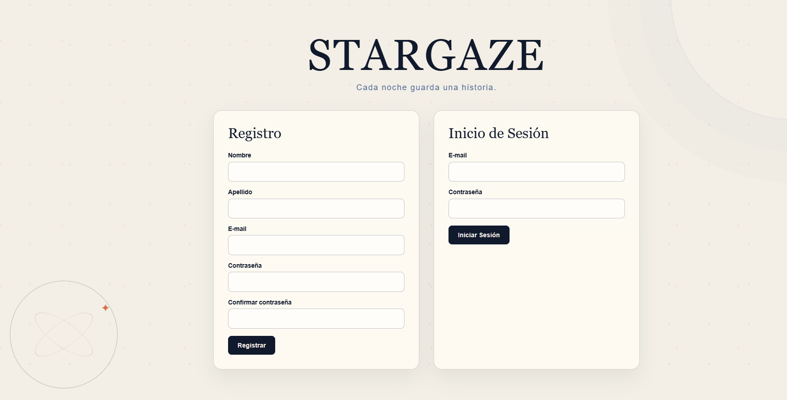
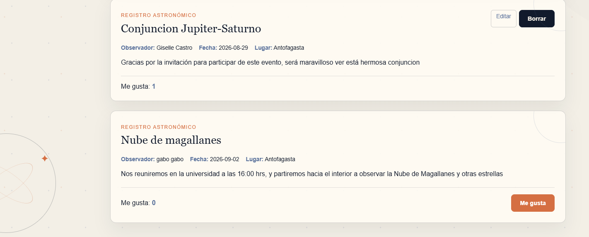
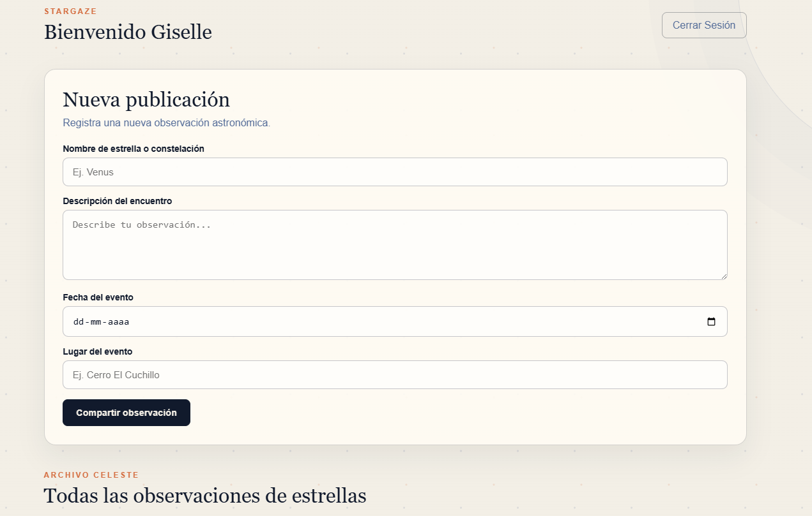

# 🌌 Stargaze

Stargaze is a full-stack web application built with **Python, Flask, and MySQL**, following an **MVC architecture**.

The application allows users to register, authenticate, create and manage publications, interact with content through likes, and securely manage their own data.

This project was developed as part of my Full Stack Python certification and demonstrates backend development, relational database design, authentication, CRUD operations, validation, and deployment.

## 🌐 Live Demo

The application is deployed and available online.

**[Launch Stargaze →](https://web-production-bd92b.up.railway.app/)**

> Create an account to explore the complete application, publish astronomical observations, and interact with other users.

---

## 🚀 Features

- User registration and login
- Secure password hashing with Bcrypt
- Session-based authentication
- Create publications
- Edit existing publications
- Delete publications
- User ownership and permission validation
- Publication validation
- Like system
- Relational MySQL database
- Dynamic content rendered with Jinja2
- MVC project architecture
- Production deployment configuration

---

## 🛠️ Tech Stack

### Backend

- Python
- Flask
- Flask-Bcrypt
- Object-Oriented Programming
- MVC Architecture

### Database

- MySQL
- SQL
- Relational database design
- JOIN queries
- Aggregations and GROUP BY

### Frontend

- HTML5
- CSS3
- JavaScript
- Jinja2

### Tools & Deployment

- Git
- GitHub
- Pipenv
- Gunicorn
- Railway

---

## 🏗️ Project Structure

```text
stargaze/
│
├── flask_app/
│   ├── config/
│   ├── controllers/
│   │   ├── publications.py
│   │   └── users.py
│   ├── models/
│   │   ├── publication.py
│   │   └── user.py
│   ├── static/
│   │   └── css/
│   ├── templates/
│   │   ├── dashboard.html
│   │   ├── edit_publication.html
│   │   └── index.html
│   └── __init__.py
│
├── Pipfile
├── Pipfile.lock
├── Procfile
├── requirements.txt
└── server.py
```

---

## 🔐 Authentication & Security

User authentication is implemented using Flask sessions and Bcrypt password hashing.

Protected routes verify that a valid user session exists before allowing access to authenticated functionality.

Users can only edit or delete publications they own.

---

## 🗄️ Database

The application uses MySQL and relational tables for:

- Users
- Publications
- Likes

SQL queries include relational joins and aggregation to associate publications with their authors and calculate interaction data such as the number of likes.

---

## 📸 Screenshots

### Authentication

Users can create an account or sign in to access the application.



### Dashboard

Authenticated users can create and share astronomical observations.



### Community Observations

Users can explore observations shared by the community, interact through likes, and manage their own publications.



---

## ⚙️ Installation

### 1. Clone the repository

```bash
git clone https://github.com/Furipe-Dono/stargaze.git
```

### 2. Enter the project directory

```bash
cd stargaze
```

### 3. Install dependencies

Using Pipenv:

```bash
pipenv install
```

### 4. Activate the virtual environment

```bash
pipenv shell
```

### 5. Configure environment variables

Create a local `.env` file based on the provided `.env.example`:

```text
MYSQLHOST=localhost
MYSQLUSER=root
MYSQLPASSWORD=your_password
MYSQLDATABASE=stargaze_schema
MYSQLPORT=3306
SECRET_KEY=your_secret_key
```

Replace the example values with your local MySQL configuration.

### 6. Create the database

Create a MySQL database named:

```text
stargaze_schema
```

Then import the provided `schema.sql` file:

```bash
mysql -u root -p stargaze_schema < schema.sql
```

The schema will create the required `users`, `publications`, and `likes` tables with their relationships and constraints.

### 7. Run the application

```bash
python server.py
```

Open the local address provided by Flask in your browser to start using Stargaze.

## 🎯 What I Practiced

This project helped strengthen my understanding of:

- Flask application architecture
- MVC separation of concerns
- User authentication
- Password hashing
- Session management
- CRUD operations
- SQL relationships
- MySQL joins and aggregation
- Server-side validation
- Authorization and ownership checks
- Deployment of Flask applications

---

## 👨‍💻 Author

**Felipe Vargas**

Full Stack Python Developer

GitHub: [@Furipe-Dono](https://github.com/Furipe-Dono)
